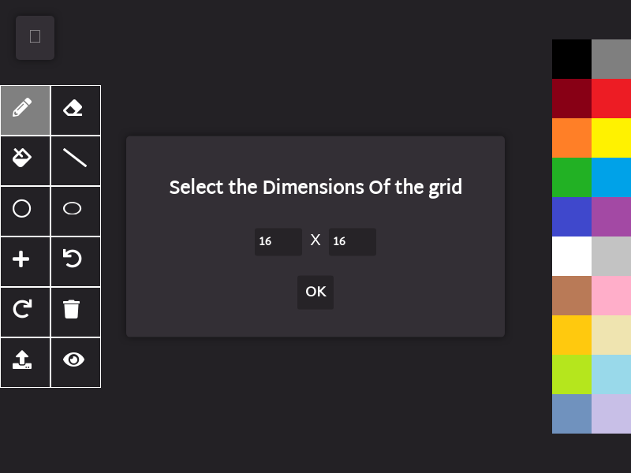
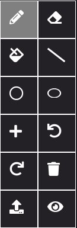

# PixelCraft
A pixel Art & Animation Creation Tool Built using HTML5 Canvas.  
It is a Progressive Web App (PWA) with offline compatibility.  
It is mobile-friendly and is very easy to use.  

## Overview
This App is Available at both these locations

https://rgab1508.github.io/PixelCraft

https://pixelcraft.web.app

On opening, you will get a screen as Follows

You can choose Any Dimensions for your Canvas, *16 X 16* is the default dimension.  
Dimensions below *128 X 128* are preferable for smooth operation and GIF creation.

## Toolbar

The List Of all Tools and methods to use them are as follows

### Pencil

The Pencil tool is the most basic tool and is used to draw pixels Freehand

### Eraser

The Eraser tool is used to erase a given pixel 1 pixel at a time. It has dimensions *1 X 1* and is fixed.

### Paint Tool

The Paint tool is used to Flood Fill a given color with a new color. It works smoothly for dimensions under 128 X 128.

### Line Tool

The line tool is used to draw a line segment between 2 points using Bresenham line drawing algorithm.  

Click on tool and click on 2 points to draw a line segment between them. 

### Circle Tool

The Circle Tool is used to draw a circle with a given centre and Radius using Midpoint Circle Algorithm.

### Ellipse Tool

The Ellipse Tool is used to draw an ellipse with given centre and it's radius along x-axis and y-axis.

## GIF Tools

### Add Frame

This tool adds the current state of canvas to the Frame Stack which can be later loaded or deleted. Each Frame is added with a delay of 100 ms, Same Frame can be multiple time to increase it's duration in GIF.

### View Frame

This tool displays a Popup with all the current frames in the Frame stack.  

**Load A Frame**: Click on the Frame.   
**Delete A Frame**: Right Click / Long press on mobile, To delete a Frame. 

## Utility Tools

### Undo/Redo

The Undo/Redo Functionality is not very advanced and is only capable of undoing/redoing 1 pixel at a time.  
It is only useful for correcting small mistakes, hence, it is advised to draw with care, or, add a frame if doing a big change with chances of mistake.

### Clear Window

This Tool is used to clear the current Canvas window.

Before:  
  
After:  
  

## Advanced Tools

### Import image

This Tool is Used to import an image and convert it to Pixel Art of Given Dimensions.

## Saving Pixel Art and GIF Animation

Once you are done with making your pixel art or animation frames you can export it as a PNG or GIF to share it on other platforms. Let's see how it's done.

### Saving Image

Save Image option is available in the Drop-down on top left corner, It will download a file named *canvas.png* with dimensions *10 x width X 10 x Height*

### Saving GIF

After making all the frames and making necessary changes in Frames Panel, you can export the GIF using option present in Dropdown. The dimensions will be same as that of image.

Thanks to [@eagleloid](https://github.com/eagleloid) for this fix [#44](https://github.com/rgab1508/PixelCraft/pull/44)

## Color Palette & Transparency

The Following colors are available on the color Palette.

You can select any color by clicking on it.  

You can also set color Transparency to create translucent colors and create color combinations. This property can be used to create complex patterns with greater flexibility.
**Right click on color to set transparency value between 0 and 1**

Thanks to [@mrfoogles](https://github.com/mrfoogles) for this fix [#41](https://github.com/rgab1508/PixelCraft/pull/41)

## PWA Support

This Web App is a Fully Compatible PWA and is installable.  

You can install it either from the Dropdown or using the "Add to Home Screen" Button From Options.  

## Some Pixel Arts Made with PixelCraft

